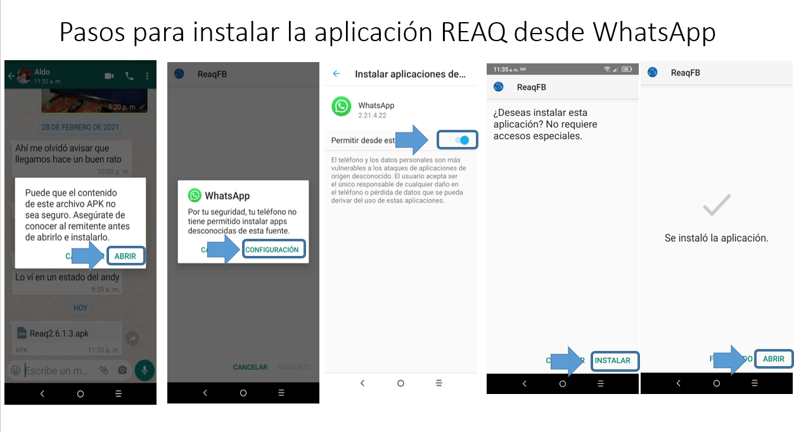

# ReAQ (Android)
ReAQ es una herramienta de aprendizaje desarrollada en **Unity 2022.3 LTS** que implementa la tecnología de Realidad Aumentada basada en la detección de marcadores, centrada en el tema de enlaces químicos (iónicos, covalentes y metálicos). Esta herramienta de aprendizaje también le permite al usuario conocer los elementos químicos más importantes para los seres vivos. En su versión que integra Google Firebase, requiere de conexión a internet. ReAQ está diseñada y probada en dispositivos Android 13 o superior. 

- **Plataforma:** Android (APK)
- **Versión mínima de Android:** Android 13 o superior
- **Licencia (código original):** GPL-3.0-or-later (see `LICENSE`)
- **Contenido/Dependencias de terceros:** Unity Asset Store assets, SQLite (v1), Firebase (v2) — ver `THIRD_PARTY_NOTICES.md`

---

## Requisitos
- Unity **2022.3 LTS**
- Android Build Support (SDK/NDK) instalado desde Unity Hub
- **Vuforia Engine 10.25.4**
- **Firebase Unity SDK 12.2.1** *(se importa vía .unitypackage y luego se ejecuta el resolver)*

## Vuforia (Package Manager)
Este proyecto usa **Vuforia Engine 10.25.4**.  
Por límite de GitHub (>100MB), el archivo `Packages/com.ptc.vuforia.engine-*.tgz` **no se versiona**.

Para restaurar dependencias:
1. Abrir el proyecto en Unity 2022.3.
2. Unity restaurará paquetes usando `Packages/manifest.json` y `Packages/packages-lock.json`.
3. Si Vuforia no se instala automáticamente: **Window → Package Manager** e instalar la versión indicada.

## Firebase (Unitypackage)
Este proyecto usa **Firebase Unity SDK 12.2.1**.  
Firebase puede no estar incluido en el repositorio y debe importarse manualmente con el `.unitypackage`.  
Después de importarlo, ejecutar el **resolver** (External Dependency Manager) para descargar/ajustar dependencias.

## Guía de Instalación (APK)
El APK no se incluye en el repositorio por tamaño. Descárgalo desde Zenodo o Google Drive.
Una vez descargado el archivo APK, procede con los pasos listados en `docs/install_apk.png`.

### Requerimientos del Sistema
- Dispositivo Android con **Android 13+**
- Suficiente espacio de almacenamiento libre para instalar el APK
- Conexión a Internet (recomendada) si se utilizan funciones que dependen de Firebase (v2)

### Descargas
- **APK (Zenodo, DOI):** https://doi.org/10.5281/zenodo.18199831
- **APK (Google Drive):** *TODO: agregar link de Drive*
- **Marcadores:** https://drive.google.com/open?id=1mZMo7cWDCHfza8nEmbgKOAAV-zAB-lpb

### Instalación (desde APK)
Una vez descargado el APK, sigue los pasos que se muestran en esta imagen guía:

> **Nota:** Si Android bloquea la instalación, habilita **Instalar aplicaciones desconocidas** para la aplicación que usaste para descargar el APK (WhatsApp/Drive/Navegador) y luego vuelve a intentar la instalación.

---

## Manual de Usuario (Inicio Rápido)

### Funcionalidades principales
1. Pantalla de Inicio de sesión / registro de un nuevo usuario. Se requiere de un correo y una contraseña
2. Pantalla principal. En esta se despliegan las opciones disponibles, así como un apartado de configuración local de la aplicación
3. Antes de abrir una escena se muestran instrucciones/objetivo
4. Configuración: activar/desactivar sonido, descargar marcadores y limpiar preferencias del usuario

### Video Tutorial
Se ha creado un video, explicando como utilizar la aplicación. Este video está disponible en:
- **YouTube video:** *https://youtu.be/g9HcKvbprao*

---

## Arquitectura del proyecto (Unity)
Este proyecto es una **aplicación móvil en Unity**. La estructura se organiza en `Assets/` por responsabilidad:

### Carpeta Principal (Unity `Assets/`)
- `Assets/Scripts/`  
  Scripts de C# que implementan la lógica de la aplicación (IU, interacciones, controladores, servicios).
- `Assets/Scenes/`  
  Escenas de Unity (Menús principales, actividades).
- `Assets/Prefabs/`  
  Objetos de UI/juego reutilizables (paneles, botones, elementos interactivos).
- `Assets/Animations/`  
  Clips de animación y controladores utilizados para UI/objetos.
- `Assets/StreamingAssets/`  
  Archivos que deben enviarse tal cual con la compilación (configuraciones, medios o recursos de tiempo de ejecución).
- `Assets/Plugins/`  
  Complementos y SDK nativos/administrados:
  - Integración con SQLite (usado en v1)
  - Firebase SDK para Unity (usado en v2)

### Vista conceptual de módulos
- **Presentación/UI:** Interfaz de usuario de Unity Canvas + navegación por escenas 
- **Lógica:** Controladores/servicios de C# en `Scripts/`  
- **Datos:** Integraciones de SQLite (v1) y Firebase (v2) en `Plugins/` y servicios relacionados

> Esta separación modular admite el mantenimiento y la evolución (por ejemplo, la migración de SQLite en v1 a Firebase en v2).

---

## License
El código original en este repositorio está licenciado bajo **GPL-3.0-or-later** — ver `LICENSE`.

## Third-party content
Este proyecto incluye contenido de terceros (Unity Asset Store) que **no** está cubierto por GPL-3.0-or-later y se licencia bajo la **Unity Asset Store EULA** y/o términos del publisher.  
También usa dependencias de terceros como **SQLite (v1)** y **Firebase (v2)**.  
Ver `THIRD_PARTY_NOTICES.md` para licencias, términos, detalles y atribuciones requeridas.

---

## Citation
If you use this software in research, please cite it using the metadata in `CITATION.cff`.
